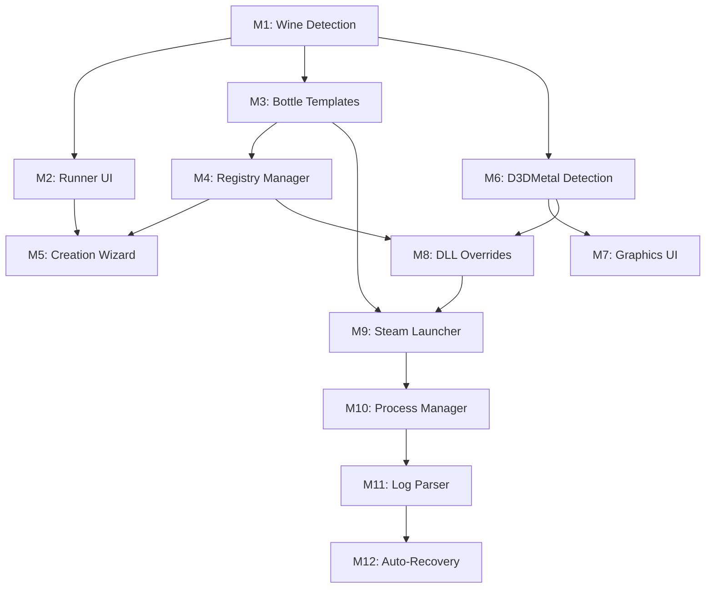

# Pancho Steam/GPTK - AI-Optimized Implementation Guide 🤖

## 📋 Quick Reference

This is a **modular, AI-assisted development plan** where each module can be implemented in a single AI chat session. No time-based deadlines—complete modules in any order respecting dependencies.

---

## 🎯 Critical Path (Do These First)



**Minimum Viable Product:** M1 → M3 → M4 → M6 → M8 → M9  
**Full Feature Set:** All 12 modules

---

## 📦 Module Quick Reference

| # | Module Name | Priority | LOC | Files | AI Complexity |
|---|-------------|----------|-----|-------|---------------|
| M1 | Wine Runner Detection | 🔴 | 200 | 2 Rust | Medium |
| M2 | Runner Selection UI | 🔴 | 150 | 1 TSX | Easy |
| M3 | Bottle Template System | 🔴 | 250 | 1 Rust | Medium |
| M4 | Registry Management | 🔴 | 300 | 2 Rust | Hard |
| M5 | Bottle Creation Wizard | 🟡 | 400 | 2 TSX | Medium |
| M6 | D3DMetal Detection | 🔴 | 200 | 1 Rust | Medium |
| M7 | Graphics Config UI | 🟡 | 250 | 1 TSX | Easy |
| M8 | DLL Override Manager | 🔴 | 200 | 1 Rust | Hard |
| M9 | Steam Launcher | 🔴 | 350 | 2 Rust | Hard |
| M10 | Process Manager | 🟡 | 400 | 2 Rust | Hard |
| M11 | Log Parser | 🟡 | 300 | 1 Rust | Medium |
| M12 | Auto-Recovery | 🟢 | 250 | 1 Rust | Hard |

---

## 🤖 AI Prompt Templates

### MODULE 1: Wine Runner Detection
**File:** `src-tauri/src/wine/runner.rs`  
**Dependencies:** None  
**Estimated Tokens:** ~2000

```
CONTEXT:
I'm building Pancho, a macOS Wine prefix manager. I need to detect all Wine/GPTK installations.

TASK:
Create a Rust module that:
1. Scans these paths for Wine executables:
   - /usr/local/bin/wine64
   - /opt/homebrew/bin/wine64
   - /usr/local/opt/game-porting-toolkit/bin/wine64
   - ~/Library/Application Support/com.isaacmarovitz.Whisky/Engines/*/bin/wine64

2. For each found Wine:
   - Run `wine --version` to get version string
   - Check for D3DMetal DLLs in ../lib/wine/x86_64-windows/
   - Classify as: Standard, GPTK, WhiskyGPTK

3. Return Vec<WineRunner> via Tauri command `get_wine_runners()`

REQUIREMENTS:
- Use tokio::process::Command for async
- Handle missing Wine gracefully (return empty vec)
- Use serde for JSON serialization
- Type: WineRunner { runner_type, path, version, supports_d3dmetal, supports_esync }

ERROR HANDLING:
- Don't panic on missing paths
- Log detection failures to console
- Continue scanning if one path fails
```

---

### MODULE 2: Runner Selection UI
**File:** `src/components/RunnerSelector.tsx`  
**Dependencies:** M1  
**Estimated Tokens:** ~1500

```
CONTEXT:
I have a Tauri command `get_wine_runners()` that returns Wine installations.

TASK:
Create React component RunnerSelector with:
1. Calls invoke<WineRunner[]>('get_wine_runners') on mount
2. Shows loading spinner while detecting
3. Displays runners in shadcn RadioGroup
4. Auto-selects GPTK runner (highest priority)
5. Shows badges for: runner type, D3DMetal support, ESync support
6. If no runners found, show install instructions with `brew install --cask whisky-wine`
7. Calls onSelect(runner) callback when user picks one

UI REQUIREMENTS:
- Use shadcn/ui components (RadioGroup, Badge, Alert)
- Use Lucide icons for wine bottles
- Show runner version in muted text
- Highlight GPTK with "Recommended for Gaming" badge
- Mobile-responsive layout

TYPES:
interface WineRunner {
  runner_type: 'Standard' | 'GPTK' | 'WhiskyGPTK';
  path: string;
  version: string;
  supports_d3dmetal: boolean;
  supports_esync: boolean;
}
```

---

### MODULE 3: Bottle Template System
**File:** `src-tauri/src/bottle/template.rs`  
**Dependencies:** M1  
**Estimated Tokens:** ~2500

```
CONTEXT:
Wine prefixes need pre-configuration. I want reusable templates.

TASK:
Create BottleTemplate system with:

1. STRUCT DEFINITION:
   - env_vars: HashMap<String, String>
   - registry_entries: Vec<RegistryEntry>
   - dll_overrides: HashMap<String, String>
   - winetricks_packages: Vec<String>
   - recommended_runner: Option<WineRunnerType>

2. PRE-BUILT TEMPLATES:
   a) Steam Gaming Template:
      - Env: WINEESYNC=1, DXVK_HUD=fps, MTL_HUD_ENABLED=1
      - Registry: HKCU\Software\Valve\Steam keys
      - DLL overrides: d3d11=native, d3d12=native
      - Packages: vcrun2019, dotnet48
   
   b) Standard Gaming Template:
      - Env: WINEESYNC=1
      - Packages: d3dx9
   
   c) Application Template:
      - Packages: corefonts

3. METHODS:
   - BottleTemplate::get_all_templates() -> Vec<Self>
   - BottleTemplate::steam_gaming() -> Self

4. TAURI COMMANDS:
   - get_bottle_templates()
   - get_template_by_id(id: String)

REQUIREMENTS:
- Full serde Serialize/Deserialize
- Templates must be immutable (const-like behavior)
- Registry entries support String, DWord, Binary types
```

---

### MODULE 4: Registry Management
**File:** `src-tauri/src/wine/registry.rs`  
**Dependencies:** M3  
**Estimated Tokens:** ~3000

```
CONTEXT:
I need to write Windows registry entries into Wine prefixes.

TASK:
Create RegistryManager that:

1. CORE FUNCTIONALITY:
   - Generate .reg files from Vec<RegistryEntry>
   - Execute: WINEPREFIX=/path wine regedit /S file.reg
   - Verify writes with: wine reg query
   - Create registry backups before modifications

2. KEY METHODS:
   pub async fn write_entries(bottle_path: &Path, entries: Vec<RegistryEntry>) -> Result<()>
   pub async fn set_dll_override(bottle_path: &Path, dll: &str, mode: &str) -> Result<()>
   pub async fn query_key(bottle_path: &Path, key: &str) -> Result<String>
   pub async fn backup_registry(bottle_path: &Path) -> Result<PathBuf>

3. REG FILE FORMAT:
   Windows Registry Editor Version 5.00

   [HKEY_CURRENT_USER\Software\Wine\DllOverrides]
   "d3d11"="native"
   
   [HKEY_CURRENT_USER\Software\Valve\Steam]
   "SteamPath"="C:\\Program Files (x86)\\Steam"

4. ERROR HANDLING:
   - Validate registry key paths
   - Check if Wine is available
   - Timeout after 30 seconds
   - Rollback on failure (restore backup)

SPECIAL CASES:
- Handle both 32-bit and 64-bit registry views
- Escape backslashes and quotes in values
- Support all RegistryValueType variants (String, DWord, Binary)

TAURI COMMANDS:
- write_registry_entries(bottle_id: String, entries: Vec<RegistryEntry>)
- set_dll_overrides(bottle_id: String, overrides: HashMap<String, String>)
```

---

### MODULE 6: D3DMetal Detection & Copy
**File:** `src-tauri/src/gptk/d3dmetal.rs`  
**Dependencies:** M1  
**Estimated Tokens:** ~2000

```
CONTEXT:
GPTK includes D3DMetal DLLs for DirectX 11/12. I need to copy them into bottles.

TASK:
Create D3DMetalManager that:

1. DETECTION:
   - Scan GPTK lib directory for:
     * d3dmetald3d11.dll
     * d3dmetald3d12.dll
     * dxgid3dmetal.dll
   - Paths: /usr/local/opt/game-porting-toolkit/lib/wine/x86_64-windows/
   - Also check Whisky engines

2. INSTALLATION:
   pub async fn copy_to_bottle(bottle_path: &Path) -> Result<()> {
       // Copy DLLs to bottle's drive_c/windows/system32/
       // Set correct permissions (0644)
       // Verify file integrity (check file size)
   }

3. VERIFICATION:
   pub async fn verify_installation(bottle_path: &Path) -> Result<bool> {
       // Check if all 3 DLLs exist and are valid PE files
   }

4. STRUCT:
   pub struct D3DMetalLibs {
       pub d3d11: Option<PathBuf>,
       pub d3d12: Option<PathBuf>,
       pub dxgi: Option<PathBuf>,
   }

TAURI COMMANDS:
- detect_d3dmetal() -> Result<D3DMetalLibs>
- install_d3dmetal(bottle_id: String) -> Result<()>
- verify_d3dmetal(bottle_id: String) -> Result<bool>

ERROR HANDLING:
- Handle missing GPTK gracefully
- Validate DLL architecture (must be x64)
- Check free disk space before copying
- Create rollback on partial failure
```

---

### MODULE 8: DLL Override Manager
**File:** `src-tauri/src/gptk/dll_override.rs`  
**Dependencies:** M4, M6  
**Estimated Tokens:** ~2500

```
CONTEXT:
Different graphics backends (D3DMetal, DXVK, WineD3D) require different DLL overrides.

TASK:
Create DllOverrideManager that:

1. BACKEND SWITCHING:
   pub enum GraphicsBackend { D3DMetal, DXVK, WineD3D }
   
   pub async fn set_backend(bottle_path: &Path, backend: GraphicsBackend) -> Result<()> {
       match backend {
           D3DMetal => {
               // Set: d3d11=native, d3d12=native, dxgi=native
               // Verify D3DMetal DLLs exist
           }
           DXVK => {
               // Set: d3d11=native, dxgi=native
               // d3d12 stays builtin
           }
           WineD3D => {
               // Remove all overrides (use Wine's built-in)
           }
       }
   }

2. CONFLICT DETECTION:
   - Warn if user has both DXVK and D3DMetal DLLs
   - Prevent setting native override without DLL present
   - Check DLL version compatibility

3. OVERRIDE MODES:
   - "native" - Use Windows DLL
   - "builtin" - Use Wine implementation  
   - "native,builtin" - Try native, fallback to builtin

4. VALIDATION:
   pub async fn validate_overrides(bottle_path: &Path) -> Result<Vec<String>> {
       // Return list of issues/warnings
   }

TAURI COMMANDS:
- set_graphics_backend(bottle_id: String, backend: GraphicsBackend)
- get_current_backend(bottle_id: String) -> Result<GraphicsBackend>
- validate_dll_overrides(bottle_id: String) -> Result<Vec<String>>

INTEGRATION:
- Use RegistryManager from M4 to write overrides
- Use D3DMetalManager from M6 to check DLL availability
```

---

### MODULE 9: Steam Launcher
**File:** `src-tauri/src/steam/launcher.rs`  
**Dependencies:** M3, M4, M8  
**Estimated Tokens:** ~3500

```
CONTEXT:
Steam requires specific launch flags and environment to avoid SteamHelper crashes.

TASK:
Create SteamLauncher with:

1. INSTALLATION:
   pub async fn install_steam(bottle: &Bottle) -> Result<()> {
       // Download Steam installer from: https://cdn.cloudflare.steamstatic.com/client/installer/SteamSetup.exe
       // Run: wine SteamSetup.exe /S (silent install)
       // Poll for steam.exe in Program Files (x86)/Steam/
       // Set registry keys (SteamPath, SteamExe)
   }

2. LAUNCH LOGIC:
   pub async fn launch_steam(bottle: &Bottle, mode: SteamLaunchMode) -> Result<Child> {
       let mut cmd = Command::new(&bottle.wine_path);
       cmd.env("WINEPREFIX", &bottle.path);
       cmd.env("WINEESYNC", "1");
       cmd.env("MTL_HUD_ENABLED", "1");
       cmd.env("WINE_D3D11_ALLOW_SWAPCHAIN_RECREATION", "1");
       
       cmd.arg("C:\\Program Files (x86)\\Steam\\steam.exe");
       
       // Critical flags to prevent SteamHelper crashes:
       cmd.arg("-no-browser");  // Disable Chromium Embedded Framework
       cmd.arg("-silent");       // Reduce log spam
       cmd.arg("-console");      // Enable debug console
       
       Ok(cmd.spawn()?)
   }

3. LAUNCH MODES:
   pub enum SteamLaunchMode {
       Normal,
       BigPicture,
       Silent,
       Console,
   }

4. GAME LAUNCHING:
   pub async fn launch_game(bottle: &Bottle, app_id: u32) -> Result<Child> {
       // Launch via: steam://rungameid/{app_id}
   }

5. HEALTH CHECK:
   pub async fn check_steam_health(bottle: &Bottle) -> Result<SteamStatus> {
       // Check if steam.exe exists
       // Verify registry keys
       // Test if Steam process starts
   }

TAURI COMMANDS:
- install_steam(bottle_id: String) -> Result<()>
- launch_steam(bottle_id: String, mode: SteamLaunchMode) -> Result<u32> // returns PID
- launch_game(bottle_id: String, app_id: u32) -> Result<u32>
- check_steam_status(bottle_id: String) -> Result<SteamStatus>

ERROR HANDLING:
- Retry installation up to 3 times
- Check if Steam is already running (prevent multiple instances)
- Timeout if installation takes > 5 minutes
- Provide actionable error messages
```

---

### MODULE 10: Process Tree Manager
**File:** `src-tauri/src/process/manager.rs`  
**Dependencies:** M9  
**Estimated Tokens:** ~4000

```
CONTEXT:
Wine spawns many child processes. I need to track and manage them all.

TASK:
Create ProcessManager with:

1. CORE TRACKING:
   pub struct ProcessInfo {
       pub pid: u32,
       pub parent_pid: Option<u32>,
       pub name: String,
       pub command: String,
       pub bottle_id: String,
       pub started_at: SystemTime,
       pub memory_mb: f64,
   }
   
   pub struct ProcessManager {
       processes: Arc<Mutex<HashMap<u32, ProcessInfo>>>,
   }

2. KEY METHODS:
   pub async fn spawn_wine_process(bottle: &Bottle, exe: &str, args: Vec<String>) -> Result<u32>
   pub async fn get_bottle_processes(bottle_id: &str) -> Vec<ProcessInfo>
   pub async fn kill_process_tree(root_pid: u32) -> Result<()>
   pub async fn is_running(pid: u32) -> bool
   pub async fn wait_for_exit(pid: u32, timeout: Duration) -> Result<()>

3. PROCESS TREE:
   - Use `ps -ax -o pid,ppid,command` to build tree
   - Recursively kill all children
   - Send SIGTERM, wait 5s, then SIGKILL

4. MONITORING:
   pub async fn monitor_process(pid: u32) -> Receiver<ProcessEvent> {
       // Stream events: Started, Crashed, Exited, HighMemory
   }

5. CLEANUP:
   - Detect orphaned Wine processes
   - Auto-cleanup on bottle deletion
   - Kill zombie processes

TAURI COMMANDS:
- get_active_processes(bottle_id: String) -> Vec<ProcessInfo>
- kill_bottle_processes(bottle_id: String) -> Result<u32> // returns count killed
- is_bottle_running(bottle_id: String) -> bool

SPECIAL CASES:
- Handle SteamHelper.exe crashes gracefully
- Don't kill wineserver (shared between bottles)
- Track process CPU/memory usage
```

---

### MODULE 11: Log Parser & Error Handler
**File:** `src-tauri/src/wine/log_parser.rs`  
**Dependencies:** M10  
**Estimated Tokens:** ~3000

```
CONTEXT:
Wine outputs stderr logs. I need to parse and categorize errors.

TASK:
Create LogParser that:

1. ERROR TYPES:
   pub enum WineError {
       MissingDLL { dll_name: String },
       DirectXError { error_code: String },
       SteamHelperCrash { reason: Option<String> },
       AccessViolation { address: String },
       MemoryError,
       RegistryError { key: String },
       Unknown { message: String },
   }

2. PATTERN MATCHING:
   Parse these patterns from Wine logs:
   - "err:module:.*\.dll" → MissingDLL
   - "err:.*SteamHelper" → SteamHelperCrash
   - "fixme:d3d11" → DirectXError
   - "0xc0000005" → AccessViolation
   - "err:.*heap" → MemoryError

3. SUGGESTION ENGINE:
   pub fn suggest_fix(error: &WineError) -> Vec<String> {
       match error {
           MissingDLL { dll_name } => vec![
               format!("Install via: winetricks {}", dll_name),
               "Check DLL overrides in bottle settings"
           ],
           SteamHelperCrash { .. } => vec![
               "Restart Steam with -no-browser flag",
               "Verify D3DMetal installation",
               "Clear Steam download cache"
           ],
           // ... more suggestions
       }
   }

4. LOG STORAGE:
   - Keep last 10,000 lines per bottle
   - Persist to: {bottle}/pancho-logs/wine.log
   - Rotate logs daily
   - Compress old logs

5. SEVERITY LEVELS:
   pub enum LogLevel { Info, Warning, Error, Fatal }

TAURI COMMANDS:
- get_bottle_logs(bottle_id: String, filter: Option<LogFilter>) -> Vec<LogEntry>
- search_logs(bottle_id: String, query: String) -> Vec<LogEntry>
- export_logs(bottle_id: String) -> Result<PathBuf>
- clear_logs(bottle_id: String) -> Result<()>

PERFORMANCE:
- Use circular buffer for in-memory logs
- Parse logs in background thread
- Don't block on I/O
```

---

### MODULE 12: Auto-Recovery System
**File:** `src-tauri/src/recovery/auto_fix.rs`  
**Dependencies:** M11  
**Estimated Tokens:** ~3000

```
CONTEXT:
When errors occur, I want to automatically attempt fixes.

TASK:
Create AutoRecovery system that:

1. FIX STRATEGIES:
   pub enum FixResult {
       Fixed { action_taken: String },
       ManualRequired { instructions: Vec<String> },
       Unfixable { reason: String },
   }
   
   pub async fn attempt_fix(bottle: &Bottle, error: WineError) -> Result<FixResult>

2. AUTO-FIX IMPLEMENTATIONS:
   
   MISSING DLL:
   - Check if it's a common DLL (vcrun, d3dx9, etc.)
   - Install via winetricks automatically
   - For D3DMetal DLLs, copy from GPTK
   
   STEAMHELPER CRASH:
   - Kill all Steam processes
   - Clear Steam cache: rm -rf drive_c/users/*/Local Settings/Application Data/Steam
   - Restart Steam with -no-browser -silent
   
   REGISTRY CORRUPTION:
   - Restore registry from latest backup
   - If no backup, recreate essential keys
   
   ACCESS VIOLATION:
   - Check if running as admin (macOS equivalent)
   - Verify file permissions
   - Suggest enabling virtual desktop mode

3. RATE LIMITING:
   - Max 3 auto-fix attempts per error type
   - 30 second cooldown between attempts
   - Store attempt history in bottle metadata

4. USER CONSENT:
   - Show notification: "Detected {error}, attempting auto-fix..."
   - Allow user to cancel during fix
   - Log all auto-fix actions

5. ROLLBACK:
   - Create snapshot before each fix
   - Allow user to rollback if fix makes things worse

TAURI COMMANDS:
- attempt_auto_fix(bottle_id: String, error: WineError) -> Result<FixResult>
- get_fix_history(bottle_id: String) -> Vec<FixAttempt>
- enable_auto_recovery(bottle_id: String, enabled: bool)

INTEGRATION:
- Listen to ProcessManager events
- Parse errors from LogParser
- Execute fixes using all previous modules
```

---

## 🎯 Implementation Strategy

### Iteration 1: Minimum Viable Product (MVP)
Complete these modules to get basic Steam gaming working:
- M1 (Wine Detection)
- M3 (Templates)
- M4 (Registry)
- M6 (D3DMetal)
- M8 (DLL Overrides)
- M9 (Steam Launcher)

**Result:** Users can create a Steam bottle and launch Steam with D3DMetal support.

### Iteration 2: Stability & UX
Add these to improve reliability:
- M2 (Runner UI)
- M5 (Creation Wizard)
- M10 (Process Manager)

**Result:** Polished UI and better process management.

### Iteration 3: Advanced Features
Complete the system:
- M7 (Graphics Config)
- M11 (Log Parser)
- M12 (Auto-Recovery)

**Result:** Production-ready with self-healing capabilities.

---

## 📝 Testing Plan

### Per-Module Testing
After completing each module, test with:
```bash
# Rust tests
cargo test --package pancho --lib wine::runner::tests

# Integration test
cargo test --test integration_test
```

### Steam Validation Checklist
Once M1-M9 are complete, test this flow:
1. [ ] Detect GPTK installation
2. [ ] Create "Steam Gaming" bottle
3. [ ] Install D3DMetal DLLs
4. [ ] Install Steam silently
5. [ ] Launch Steam successfully
6. [ ] Log into Steam account
7. [ ] Install small game (Portal, < 1GB)
8. [ ] Launch game and verify it runs
9. [ ] Close Steam cleanly
10. [ ] Verify no orphaned processes

---

## 🐛 Common Issues & Solutions

### "SteamHelper.exe has stopped working"
**Cause:** CEF (Chromium Embedded Framework) incompatibility  
**Fix:** Launch Steam with `-no-browser` flag (M9)  
**Prevention:** Set flag by default in Steam template (M3)

### "Missing d3d11.dll"
**Cause:** D3DMetal DLLs not installed  
**Fix:** Run M6 install_d3dmetal command  
**Prevention:** Auto-install when using Steam template

### "Access violation at 0xc0000005"
**Cause:** Missing registry keys or wrong DLL overrides  
**Fix:** Verify registry keys (M4), check DLL overrides (M8)  
**Prevention:** Use validated templates (M3)

### Orphaned Wine Processes
**Cause:** Improper shutdown  
**Fix:** Use M10 kill_process_tree  
**Prevention:** Always cleanup on app close

---

## 📚 AI Prompt Best Practices

### 1. Provide Full Context
Include type definitions, dependencies, and file structure in every prompt.

### 2. Specify Error Handling
Always ask for: "Handle all errors gracefully, don't panic, return Result<T, String>"

### 3. Request Tests
Add: "Include unit tests for core functionality"

### 4. Ask for Documentation
End with: "Add doc comments to all public functions"

### 5. Iterative Refinement
If output is incomplete:
```
"The previous code works but needs improvement:
1. Add error handling for {scenario}
2. Optimize {function} for performance
3. Add validation for {input}
Please provide only the improved sections."
```

---

## 🎓 Learning Resources

### Wine/GPTK Documentation
- [Wine HQ](https://www.winehq.org/)
- [Apple GPTK Guide](https://developer.apple.com/games/game-porting-toolkit/)
- [Whisky Source](https://github.com/Whisky-App/Whisky) - Reference implementation

### Rust Async
- [Tokio Tutorial](https://tokio.rs/tokio/tutorial)
- [Async Book](https://rust-lang.github.io/async-book/)

### Tauri v2
- [Tauri Docs](https://v2.tauri.app/)
- [Commands Guide](https://v2.tauri.app/develop/calling-rust/)

---

## ✅ Module Completion Checklist Template

Copy this for each module:

```markdown
## Module X: [Name] - Completion Report

### Implementation
- [ ] Core functionality complete
- [ ] Error handling implemented
- [ ] Tauri commands exported
- [ ] Types properly annotated

### Testing
- [ ] Unit tests pass
- [ ] Manual testing successful
- [ ] Edge cases handled

### Integration
- [ ] Imports work in dependent modules
- [ ] Tauri app compiles
- [ ] Frontend can call commands

### Documentation
- [ ] Function docs written
- [ ] Usage examples added
- [ ] Known issues documented

### Next Steps
- Module Y depends on this - can proceed
- Identified 2 improvements for future iteration
```

---

## 🚀 Quick Start Commands

```bash
# Start new module implementation
git checkout -b feature/module-X-name

# Test as you code
cargo watch -x "test --lib module_name"

# Check compilation
cargo check --all-targets

# Run full dev environment
npm run tauri dev

# Commit when complete
git add .
git commit -m "feat: implement module X - name"
```

---

## 📊 Progress Tracking

Create a GitHub Project or use this markdown:

```markdown
## Implementation Progress

### Critical Path
- [x] M1: Wine Runner Detection
- [ ] M3: Bottle Template System
- [ ] M4: Registry Management
- [ ] M6: D3DMetal Detection
- [ ] M8: DLL Override Manager
- [ ] M9: Steam Launcher

### Enhancement Path
- [ ] M2: Runner Selection UI
- [ ] M5: Bottle Creation Wizard
- [ ] M7: Graphics Config UI
- [ ] M10: Process Manager
- [ ] M11: Log Parser
- [ ] M12: Auto-Recovery

### Blockers
- None currently

### Next Session
- Start Module 3: Bottle Template System
- Expected completion: 1-2 hours with AI assistance
```

---

**Remember:** No deadlines, no pressure. Complete modules one at a time with AI assistance. Each module is self-contained and tested independently.

Focus on the critical path first (M1→M3→M4→M6→M8→M9) to get a working Steam launcher, then iterate on UX and advanced features.

Good luck! 🍀
